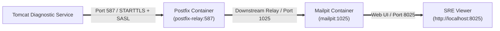

# 🚀 Postfix Enterprise SMTP Relay Bridge

[](Containerfile)
[](README.md)
[](LICENSE)
[](CONFIG)

This repository provides a containerized **Postfix Enterprise SMTP Relay Bridge** for the Tomcat Monitoring & Diagnostics platform. It emulates a hardened corporate mail gateway within the local environment.

---

## 📑 Table of Contents

- [🏛️ Architecture & Mail Flow](#️-architecture--mail-flow)
- [🚀 Key Advantages & Design Invariants](#-key-advantages--design-invariants)
- [📋 Port Specifications & Network](#-port-specifications--network)
- [📦 Installation & Deployment Guide](INSTALL.md)
- [🛠️ Build & Lifecycle Commands](#️-build--lifecycle-commands)
- [📂 Repository Structure](#-repository-structure)
- [📄 License, Ownership & Disclaimer](#-license-ownership--disclaimer)

---

## 🏛️ Architecture & Mail Flow



---

## 🚀 Key Advantages & Design Invariants

1. **Realistic Enterprise Triage Verification:** The Diagnostic Service tests authenticated SMTP delivery against real-world enterprise protocols (Cyrus SASL username/password, STARTTLS encryption, delivery timeouts, and queue retries).
2. **Visual Incident Triage (Mailpit UI):** Postfix forwards authenticated emails downstream to Mailpit, allowing SRE operators to inspect rich 7-section HTML/text incident reports in their browser (`http://localhost:8025`).
3. **100% Offline & Self-Contained:** Eliminates dependencies on external third-party mail providers (e.g., Sendgrid, Office365) and prevents accidental outbound alert leaks.

---

## 📋 Port Specifications & Network

- **Port 587 (Submission):** Mandatory / opportunistic STARTTLS with Cyrus SASL authentication (`PLAIN`, `LOGIN`).
- **Port 25 (Internal):** Standard internal SMTP relay.
- **Downstream Relay Target:** `mailpit:1025`.
- **Target Network:** `devops-lab`.

---

## 📦 Installation & Deployment

For complete image build instructions, SASL authentication configuration, and standalone/fleet deployment steps, refer to the dedicated [**`INSTALL.md`**](INSTALL.md) guide.

```bash
# Build OCI image locally
./scripts/build.sh

# Deploy via tmctl operator CLI
tmctl stack deploy --target postfix
```

---

## 🛠️ Build & Lifecycle Commands

```bash
# Build local container image
./scripts/build.sh

# Execute smoke test suite
./scripts/test.sh

# Run container on devops-lab network
./scripts/run.sh

# Stop and remove container
./scripts/clean.sh
```

---

## 📂 Repository Structure

```text
postfix-relay/
├── AGENTS.md                  Agent governance principles
├── CONFIG                     Configuration parameters & defaults
├── Containerfile              Hardened Alpine Postfix OCI container
├── LICENSE                    Apache License 2.0
├── PROJECT                    Script-readable project identifier
├── README.md                  Technical architecture documentation
├── VERSION                    Release version
├── entrypoint.sh              Runtime SASL initialization & Postfix daemon runner
└── scripts/
    ├── build.sh               Image build script
    ├── clean.sh               Container cleanup utility
    ├── run.sh                 Container runner
    └── test.sh                Automated smoke test suite
```

---

## 📄 License, Ownership & Disclaimer

### 👤 Author & Ownership
This repository, along with its associated architectures, automation components, and codebases, is designed, authored, and maintained by **Eddy Wiyatno** ([@edkas07-oss](https://github.com/edkas07-oss)).

### ⚖️ License
This project is licensed under the [Apache License 2.0](LICENSE) - see the [LICENSE](LICENSE) file for complete terms and conditions.

### 🛡️ Research & Development Disclaimer
> [!NOTE]
> All research, development, architectural design, prototyping, test fixtures, and validation suites in this repository were conducted and verified exclusively within **independent, personal laboratory environments** using personal hardware, network infrastructure, and self-hosted tooling. No confidential corporate assets, proprietary production data, or third-party enterprise infrastructure were utilized in the creation or publication of this project.
