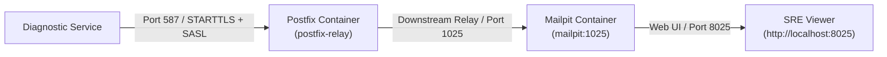

# Postfix Enterprise SMTP Relay Bridge (Pola A)

Repository ini menyediakan OCI image Postfix sebagai Containerized Enterprise Relay Bridge untuk lingkungan monitoring dan alerting `devops-lab`.



## Keunggulan Pola A

1. **Pengujian Enterprise Nyata**: Diagnostic Service menguji otentikasi nyata (SASL username & password terenkripsi), sertifikat TLS/STARTTLS, proteksi timeout, dan retry queue management.
2. **Tetap Memiliki Web UI**: Postfix meneruskan (forward / transport) email yang sudah terotentikasi ke Mailpit, sehingga tim SRE tetap bisa melihat dan memeriksa tampilan visual Laporan Investigasi 7-Seksi SRE di browser (`http://localhost:8025`).
3. **100% Offline & Mandiri (Self-Contained)**: Tidak membutuhkan koneksi internet atau akun email eksternal (seperti Gmail, Office365, atau Sendgrid) dan tidak ada risiko kebocoran data lab ke luar.

## Spesifikasi & Port

- **Port 587**: Submission port dengan mandatory/opportunistic STARTTLS dan Cyrus SASL authentication (`PLAIN`, `LOGIN`).
- **Port 25**: SMTP relay internal.
- **Downstream Relay**: `mailpit:1025`.
- **Network**: `devops-lab`.

## Commands

```bash
# Membangun image lokal
./scripts/build.sh

# Smoke test image
./scripts/test.sh

# Menjalankan container di network devops-lab
./scripts/run.sh

# Menghentikan dan menghapus container
./scripts/clean.sh
```
